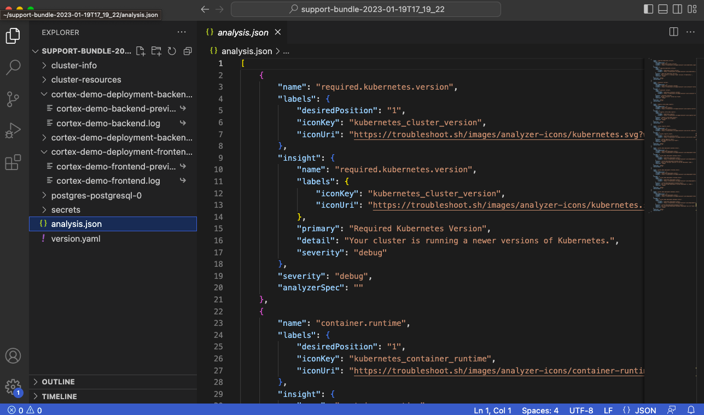

## Troubleshooting Cortex 

For instances of Cortex running on Kubernetes clusters, you can use this tool to not only collect information but also provide a quick diagnostics that may help find the issue.

### About Troubleshoot

For this we are using an open source project from Replicated called Troubleshoot. This project provides the ability to specify in a YAML file what to collect and analyze. The results from the analyzers are displayed to the user as well as included in the resulting tar ball that contains everything that was collected.

### How Are We Using It

In order to make this as simple as possible we have create scripts that automate this entire process. To better understand the process, let's outline all the steps (please note that these have to be peformed on a machine with `kubectl` access to the cluster hosting Cortex):

- Download the `support-bundle` binary
- - You can download it as a `kubectl` plugin using `krew`
- - You can download the binary and run it by itself

- Download/find/create a Support Bundle spec that outlines everyhing to collect & analyze based on what is available 

- Run the command 
- - 'kubectl support-bundle spec.yaml
- - or
- - 'support-bundle spec.yaml`

**Important!** Right now all the specs are set to run on the default namespace and collects everything it can from the cluster. Depending on how locked down our customer's clusters are, we may need to be more specific as to which namespace to collect information from. 

## How to Run the Script

As of the time of this writing, there is only a script for M1 Macs. There are separate binaries to download based on the platform and right now the binary to download is hard-coded.

To test the script on your M1 Mac try running:

**hint:** create a new directory and run the command from this directory as files will be downloaded and at this moment cleanup has not been implemented

```shell

curl https://raw.githubusercontent.com/cortexapps/solutions/troubleshoot/tools/troubleshoot/scripts/darwin_arm.sh | sh

```
This should produce an output similar to this:


To save the bundle click on the `s` key and then `q` to quite and get back to your terminal

## Viewing the Results

When you save the support bundle it will have a name that in a similar format:

`support-bundle-YYYY-MM-DDTHH_MM_SS.tar.gz`

This tar ball contains all the contents that the tool collected. You can untar it using your preferred tool, here is the tar command as an example

```shell

tar -zxvf support-bundle-2023-01-19T17_19_22.tar.gz

```

Once you have it expanded, you can view the contents using your favorite editor. I like to use VS Code to open the folder and view all the contents.

# Cluster Info

This will contain basic information about the cluster, like the version


# Cluster Resources

This will contain information about all the various resources running on the cluster. In this example, we can see the deployment for Cortex.


# Cortex Logs

You can also view the logs we collected:


# Analyzer Results

If you want to check the results of the analyzers after that UI is long gone, check the `analysis.json` file



